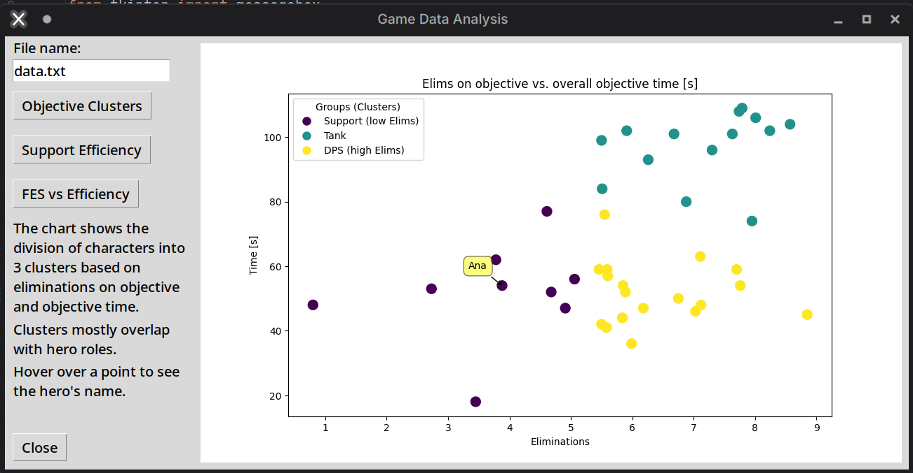

# Overwatch Data Analytics Desktop App
## Project Description

This project is an **interactive desktop application** in Python for analyzing hero statistics from the game Overwatch. It leverages libraries such as Pandas, Matplotlib, and Scikit-learn for data processing, visualization, and statistical analysis.

Image 1. *Objective Cluster*

**Requirements**

Application requires following packages:
- pandas
- numpy
- matplotlib
- scikit-learn
- seaborn
- mplcursors

You can install all dependencies with this command:
*pip install -r requirements.txt*

**Key Features**
### **Graphical User Interface (Tkinter):**
   - Loads data from a text file (.txt format)
   - Generates interactive plots within the application window
   - Includes three buttons for different analyses

### **Statistical Analyses:**
   - **Hero Clustering (KMeans):**
     - Groups heroes based on "Obj kills" and "OV s" statistics
     - Highlights three roles: Tank, DPS, Support
     - Interactive tooltips (on hover) displaying hero names
   - **KDAH Indicator for Supports:**
     - New metric: KDAH = KDA * (Healing / 1000)
     - Shows correlation with win rate
     - Linear regression and interactive tooltips
   - **FES Analysis:**
     - FES = Elims / (Solo kills + Final blows)
     - Efficiency = (Damage/Elims + Healing/1000)/100
     - Boxplot analysis for efficiency groups

## **Technologies Used**
   - `pandas` – data processing
   - `matplotlib` – visualizations
   - `scikit-learn` – machine learning algorithms (KMeans)
   - `mplcursors` – interactive tooltips
   - `seaborn` – advanced visualizations
   - `tkinter` – user interface

## Use Cases
- Analyzing hero balance
- Identifying gameplay patterns
- Optimizing data-driven strategies
